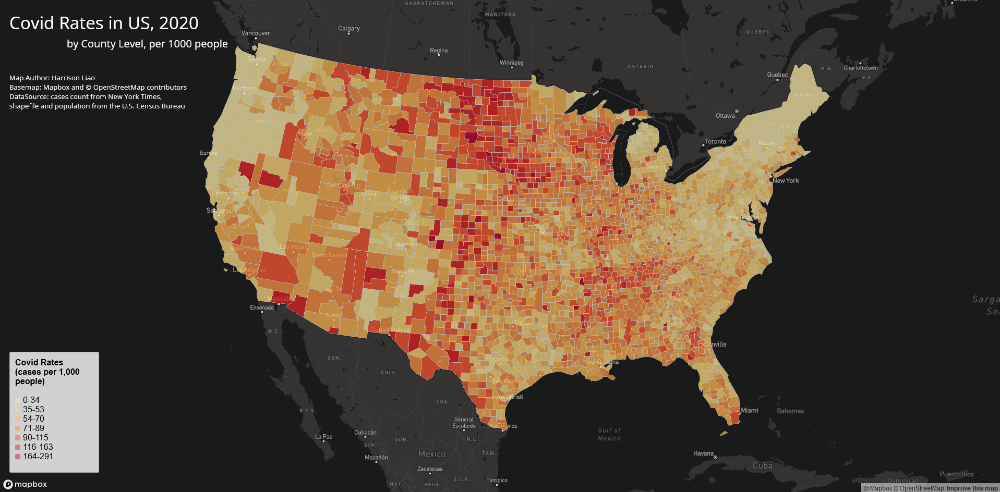
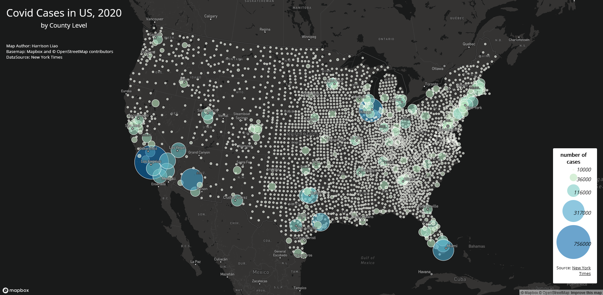

# Touching on Covid Cases in the United States

Harrison Liao || GEOG 458 AD
hxliaoay@uw.edu 

---
In this project two maps were made to tackle the topic of the spread of Covid-19 cases in the United States, measured by the county level with data from 2020.  The first map is a choropleth map made to examine the rate of getting Covid-19, measured by case per 1,000 people on a county level.  The second map is a proportional symbol map that maps out the total number of cases of Covid-19 by county.  Maps can be found below:

#### [map 1: Covid Rates in US, 2020](map1.html)

This map is made by implementing a Mapbox as the base map layer and inserting a geojson file that contains county shapes and data located with it.  Then the choropleth layer and its legend are added, colors using a scale from YlOrRd color ramp with rates sorted by natural breaks. The remaining text is built from html text blocks.

#### [map 2: Covid Cases in US, 2020](map2.html)

This map is made by implementing a Mapbox as the base map layer and inserting a geojson file with a dot representing each county, along with its data.  The proportional symbol is added as a map layer, scaled both in size and a YlGnBu color ramp, sorted by natural breaks.  The remaining text is built from html word blocks.

The data used to construct the maps come from:

- New York Times ([number of Covid-19 cases](https://github.com/nytimes/covid-19-data/blob/43d32dde2f87bd4dafbb7d23f5d9e878124018b8/live/us-counties.csv))
- United States Census Bureau ([countyshape files](https://www.census.gov/geographies/mapping-files/time-series/geo/carto-boundary-file.html) and [population estimates](https://data.census.gov/cedsci/table?g=0100000US%24050000&d=ACS%205-Year%20Estimates%20Data%20Profiles&tid=ACSDP5Y2018.DP05&hidePreview=true))
- Mapbox and © OpenStreetMap contributors (base map)

Acknowledgements

- Lecture and Templates of map file from Dr. Bo Zhao's [class material for GEOG 458](https://github.com/jakobzhao/geog458/tree/master/labs/lab03)
- Data processing from Steven Bao, Teaching Assistant of GEOG 458

